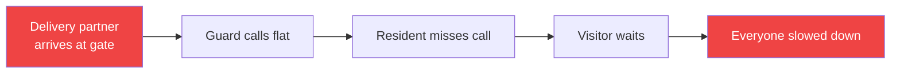
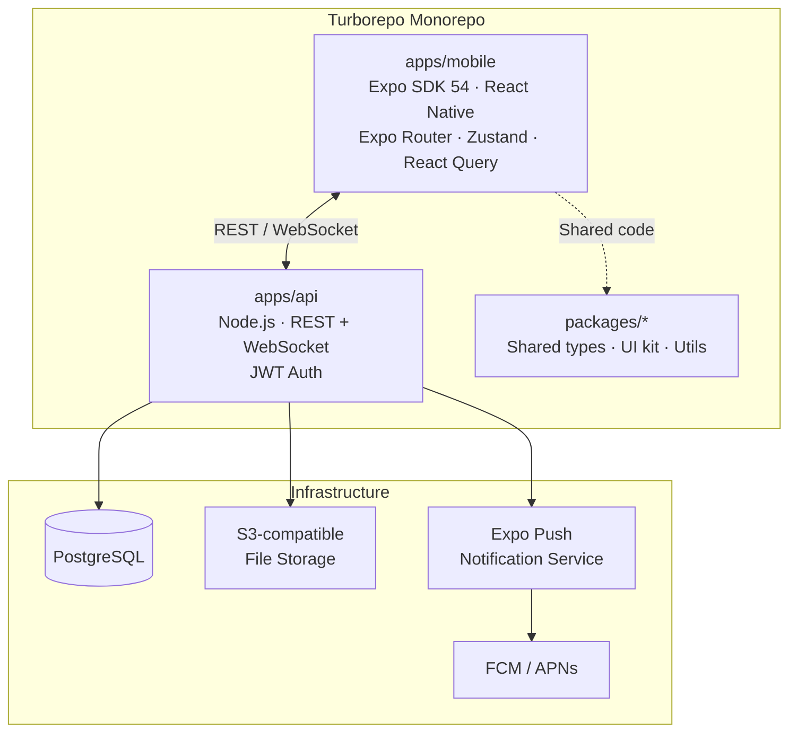
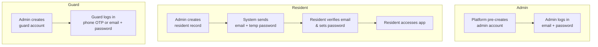
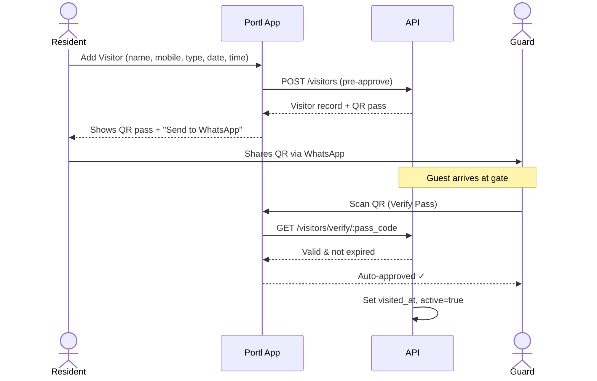
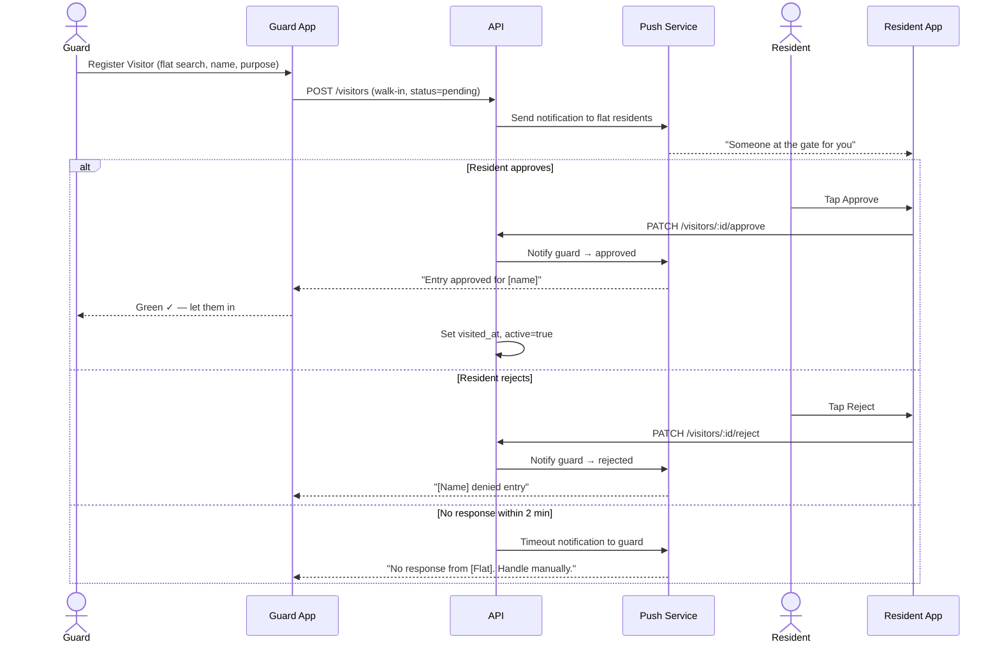
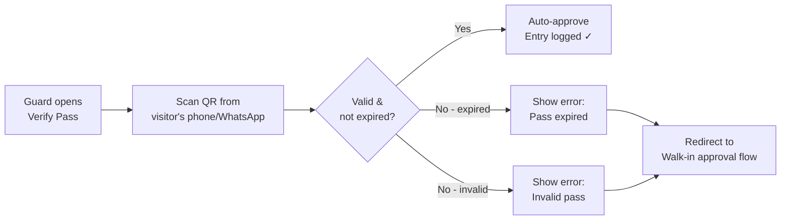
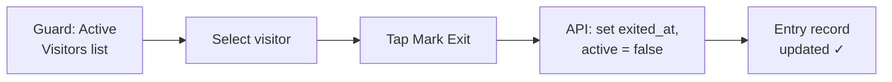
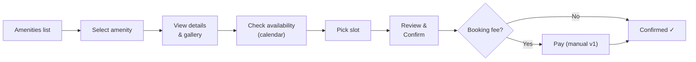
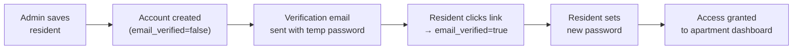

# Portl — Society Management App
## Product Requirements Document (PRD)

> **Version:** 1.0
> **Last Updated:** 2026-07-15
> **Status:** Draft
> **Tech Stack:** Expo · React Native · Turborepo Monorepo

---

## Table of Contents

1. [Product Overview](#1-product-overview)
2. [Problem Statement](#2-problem-statement)
3. [Goals & Success Metrics](#3-goals--success-metrics)
4. [User Roles & Personas](#4-user-roles--personas)
5. [System Architecture](#5-system-architecture)
6. [Data Models](#6-data-models)
7. [Feature Specifications](#7-feature-specifications)
   - 7.1 [Authentication & Onboarding](#71-authentication--onboarding)
   - 7.2 [Visitor Management](#72-visitor-management)
   - 7.3 [Guard Dashboard](#73-guard-dashboard)
   - 7.4 [Resident Dashboard](#74-resident-dashboard)
   - 7.5 [Amenity Booking](#75-amenity-booking)
   - 7.6 [Notice Board](#76-notice-board)
   - 7.7 [Community Polls](#77-community-polls)
   - 7.8 [Helpdesk & Complaints](#78-helpdesk--complaints)
   - 7.9 [Society Admin Dashboard](#79-society-admin-dashboard)
   - 7.10 [Staff & Service Provider Directory](#710-staff--service-provider-directory)
   - 7.11 [Maintenance & Payments](#711-maintenance--payments)
8. [Navigation & Screen Map](#8-navigation--screen-map)
9. [Push Notifications](#9-push-notifications)
10. [Non-Functional Requirements](#10-non-functional-requirements)
11. [Out of Scope (v1)](#11-out-of-scope-v1)

---

## 1. Product Overview

**Portl** is a mobile-first society management platform that digitises every conversation that used to happen at the apartment gate or in a WhatsApp group — and moves them into one seamless, role-aware mobile experience.

The platform serves three distinct roles — **Resident**, **Security Guard**, and **Society Admin** — each with their own dashboard, permissions, and workflows.

> **Core Thesis:** The conversations that used to happen at the society gate should now happen inside one community app.

---

## 2. Problem Statement

Apartment communities today run on an informal stack of phone calls, WhatsApp groups, paper registers, and manual approvals. Every workflow is fragmented:

| Stakeholder | Pain Today |
|---|---|
| **Resident** | Misses gate calls, unaware of visitor arrivals, uses WhatsApp for complaints and bookings |
| **Security Guard** | Paper entry registers, manual phone calls to flats, no digital record of movement |
| **Society Admin** | Spreadsheets for residents, notices sent via WhatsApp blasts, no audit trail |
| **Visitor** | Waits at the gate while the guard tries to reach the resident |

**The core friction:**

---

## 3. Goals & Success Metrics

### Primary Goals
- Replace paper registers and gate phone calls with a real-time digital approval flow.
- Give residents full visibility and control over who enters their home.
- Give admins a single operations dashboard for all society workflows.

### Success Metrics (v1)

| Metric | Target |
|---|---|
| Visitor approval time | < 30 seconds from guard request to resident decision |
| Daily active usage by guards | ≥ 80% of shift sessions use the app for entry logging |
| Resident adoption | ≥ 60% of registered residents approve at least one visitor in Month 1 |
| Complaint resolution visibility | 100% of raised tickets have a visible status for the resident |

---

## 4. User Roles & Personas

### 4.1 Resident
A person living in a flat in the society. May be the primary account holder or a family member.

**Permissions:**
- Approve / reject visitor entry requests
- Pre-approve guests and generate visitor passes
- View own visitor history
- Book amenities
- View notices
- Participate in polls
- Raise and track helpdesk complaints
- Pay maintenance dues

### 4.2 Security Guard
A staff member stationed at the society gate. Operates the guard-facing app on a shared or personal device.

**Permissions:**
- Register walk-in visitors
- Search residents by flat / name
- Send approval requests to residents
- Scan / verify visitor QR passes
- Mark visitor entry and exit
- View entry/exit log
- View notices addressed to guards

### 4.3 Society Admin
The RWA president, secretary, or property management staff responsible for running the society.

**Permissions:**
- Full CRUD on Towers, Flats, Residents, Amenities, Notices, Polls, Complaints, Staff & Service Providers
- View all visitor logs across the society
- Manage and resolve helpdesk tickets
- Broadcast notices to residents and/or guards
- Create and close polls
- Manage maintenance dues

---

## 5. System Architecture

### Frontend — `apps/mobile`

| Concern | Choice |
|---|---|
| Framework | Expo SDK 54 + React Native |
| Navigation | Expo Router (file-based routing) |
| Global state | Zustand |
| Server state / caching | TanStack React Query |
| Push Notifications | Expo Notifications + FCM / APNs |
| QR Scanning | expo-barcode-scanner |
| QR Generation | react-native-qrcode-svg |
| Secure storage | expo-secure-store (JWT) |

### Backend — `apps/api`

| Concern | Choice |
|---|---|
| Runtime | Node.js |
| API | REST + WebSocket (real-time approval flow) |
| Auth | JWT (short-lived) + refresh token rotation |
| Database | PostgreSQL |
| File storage | S3-compatible bucket |
| Push | Expo Push Notification Service (EPNS) |

---

## 6. Data Models

### 6.1 Society

| Field | Type | Notes |
|---|---|---|
| id | uuid | PK |
| name | string | |
| address | string | |
| city, state, pincode | string | |
| logo_url | string | |
| created_at | timestamp | |

### 6.2 Tower

| Field | Type | Notes |
|---|---|---|
| id | uuid | PK |
| society_id | uuid | FK → Society |
| name | string | Tower / Block name |
| location | string | e.g. "North Wing" |
| total_floors | int | |
| apartment_number | string | Internal reference |
| created_at | timestamp | |

### 6.3 Flat

| Field | Type | Notes |
|---|---|---|
| id | uuid | PK |
| tower_id | uuid | FK → Tower |
| flat_number | string | |
| floor | int | |
| number_of_rooms | int | |
| number_of_bathrooms | int | |
| has_kitchen | bool | |
| has_balcony | bool | |
| has_hall_room | bool | |
| created_at | timestamp | |

### 6.4 User _(all roles)_

| Field | Type | Notes |
|---|---|---|
| id | uuid | PK |
| society_id | uuid | FK → Society |
| role | enum | `resident \| guard \| admin` |
| name | string | |
| father_name | string | |
| email | string | unique |
| phone | string | |
| address | string | |
| profile_photo_url | string | |
| email_verified | bool | default false |
| created_at, updated_at | timestamp | |

### 6.5 Resident _(extends User)_

| Field | Type | Notes |
|---|---|---|
| user_id | uuid | FK → User (PK) |
| flat_id | uuid | FK → Flat |
| is_owner | bool | owner vs tenant |
| family_details | jsonb | spouse, children, etc. |
| booking_charge | decimal | |
| booked_at | date | |
| security_deposit_amount | decimal | |
| security_deposit_paid_on | date | |
| created_at | timestamp | |

### 6.6 Visitor

| Field | Type | Notes |
|---|---|---|
| id | uuid | PK |
| society_id | uuid | FK → Society |
| flat_id | uuid | FK → Flat |
| resident_id | uuid | FK → User (resident who pre-approved or is being notified) |
| name | string | |
| mobile | string | |
| type | enum | `guest \| delivery \| cab \| service_staff` |
| purpose | string | |
| photo_url | string | optional, captured by guard |
| **Pass** | | |
| pass_code | uuid | unique QR token |
| qr_payload | string | encoded pass data |
| pass_generated_at | timestamp | |
| expires_at | timestamp | |
| active | bool | false after exit |
| **Approval** | | |
| approved | bool \| null | null = pending |
| approved_by | uuid | FK → User |
| approved_at | timestamp | |
| **Movement** | | |
| visited_at | timestamp | entry time |
| exited_at | timestamp | exit time |
| created_at | timestamp | |

### 6.7 Amenity

| Field | Type | Notes |
|---|---|---|
| id | uuid | PK |
| society_id | uuid | FK → Society |
| name | string | e.g. "Swimming Pool" |
| description | text | |
| category | string | e.g. "Sports", "Wellness" |
| eligible_tower_ids | uuid[] | towers whose residents can book |
| floor_number | int | |
| location | string | e.g. "Ground Floor, Block A" |
| guard_id | uuid | FK → User (assigned guard) |
| gallery | string[] | photo URLs |
| capacity | int | max persons |
| booking_required | bool | |
| booking_duration_minutes | int | |
| booking_fee | decimal | ₹ |
| availability_days | string[] | e.g. ["Mon","Wed","Fri"] |
| open_hours_start | time | |
| open_hours_end | time | |
| status | enum | `active \| under_maintenance \| closed` |
| rules_and_guidelines | text | |
| created_at | timestamp | |

### 6.8 Amenity Booking

| Field | Type | Notes |
|---|---|---|
| id | uuid | PK |
| amenity_id | uuid | FK → Amenity |
| booked_by | uuid | FK → User |
| slot_date | date | |
| slot_start | time | |
| slot_end | time | |
| amount_paid | decimal | |
| payment_status | enum | `pending \| paid \| refunded` |
| status | enum | `pending \| confirmed \| cancelled` |
| created_at | timestamp | |

### 6.9 Notice

| Field | Type | Notes |
|---|---|---|
| id | uuid | PK |
| society_id | uuid | FK → Society |
| created_by | uuid | FK → User (admin) |
| title | string | |
| description | text | |
| recipients | enum | `residents \| guards \| all` |
| attachments | string[] | file URLs |
| published_at | timestamp | |
| expires_on | date | |
| created_at | timestamp | |

### 6.10 Poll

**Poll**

| Field | Type | Notes |
|---|---|---|
| id | uuid | PK |
| society_id | uuid | FK → Society |
| created_by | uuid | FK → User (admin) |
| title | string | |
| description | text | |
| status | enum | `upcoming \| live \| closed` |
| start_date | date | |
| end_date | date | |
| created_at | timestamp | |

**PollOption**

| Field | Type | Notes |
|---|---|---|
| id | uuid | PK |
| poll_id | uuid | FK → Poll |
| label | string | |
| vote_count | int | cached counter |

**PollVote**

| Field | Type | Notes |
|---|---|---|
| id | uuid | PK |
| poll_id | uuid | FK → Poll |
| option_id | uuid | FK → PollOption |
| user_id | uuid | FK → User |
| voted_at | timestamp | |

### 6.11 Helpdesk Ticket

**HelpdeskTicket**

| Field | Type | Notes |
|---|---|---|
| id | uuid | PK |
| society_id | uuid | FK → Society |
| raised_by | uuid | FK → User (resident) |
| flat_id | uuid | FK → Flat |
| category | enum | `maintenance \| complaint \| request \| other` |
| title | string | |
| description | text | |
| attachments | string[] | photo URLs |
| status | enum | `open \| in_progress \| resolved \| closed` |
| assigned_to | uuid \| null | FK → User (staff/admin) |
| created_at, updated_at, resolved_at | timestamp | |

**TicketComment**

| Field | Type | Notes |
|---|---|---|
| id | uuid | PK |
| ticket_id | uuid | FK → HelpdeskTicket |
| user_id | uuid | FK → User |
| message | text | |
| created_at | timestamp | |

### 6.12 Staff / Service Provider

| Field | Type | Notes |
|---|---|---|
| id | uuid | PK |
| society_id | uuid | FK → Society |
| name | string | |
| contact | string | phone |
| address | string | |
| photo_url | string | |
| category | enum | `security_guard \| electrician \| maid \| milkman \| plumber \| carpenter \| other` |
| active | bool | |
| created_at | timestamp | |

### 6.13 Maintenance Due

| Field | Type | Notes |
|---|---|---|
| id | uuid | PK |
| society_id | uuid | FK → Society |
| flat_id | uuid | FK → Flat |
| resident_id | uuid | FK → User |
| period_label | string | e.g. "July 2026" |
| amount | decimal | ₹ |
| due_date | date | |
| status | enum | `pending \| paid \| overdue` |
| paid_at | timestamp | |
| transaction_id | string | for future gateway integration |
| created_at | timestamp | |

---

## 7. Feature Specifications

### 7.1 Authentication & Onboarding

#### Onboarding Flows by Role

#### Screens
- **Splash** — app logo + loading indicator
- **Login** — email/phone + password; role auto-detected from JWT claims
- **Email Verification** — deep-link handler; sets `email_verified = true`
- **Set Password** — first-time flow for residents (temp password → new password)
- **Forgot Password** — OTP-based reset via email

#### Rules
- JWT stored via `expo-secure-store`
- Role encoded in JWT → app redirects to the correct root navigator on login
- Silent token rotation (refresh token in httpOnly cookie or secure store)

---

### 7.2 Visitor Management

This is the **core workflow** of Portl — replacing the gate phone call.

#### 7.2.1 Pre-Approval Flow (Resident initiates)

**Add Visitor screen fields:**

| Field | Type | Required |
|---|---|---|
| Name | text | ✓ |
| Mobile | phone | ✓ |
| Type | select: guest / delivery / cab / service_staff | ✓ |
| Date of visit | date picker | ✓ |
| Time of visit | time picker | optional |

**Visitor History screen:**
- Columns: name, mobile, type, visit date, pass generated, status, approved_at, visited_at
- Action: **View Pass** → QR code modal + "Send to WhatsApp" button

#### 7.2.2 Walk-In Approval Flow (Guard initiates)

**Register Visitor screen fields (Guard):**

| Field | Type | Required |
|---|---|---|
| Tower | select | ✓ |
| Flat | select (filtered by tower) | ✓ |
| Visitor Name | text | ✓ |
| Purpose | text | ✓ |
| Visitor Type | select: guest / delivery / cab / service_staff | ✓ |
| Photo | camera capture | optional |

**Approval Request screen (Resident):**
- Shows: visitor name, type, purpose, flat, guard photo (if captured)
- Actions: **Approve** (green) | **Reject** (red)
- 2-minute timeout countdown visible

#### 7.2.3 QR Pass Verification (Guard scans)

#### 7.2.4 Exit Logging (Guard)

#### Visitor Type Matrix

| Type | Approval | Pass expiry | Extra data |
|---|---|---|---|
| Guest | Resident approval | End of day | — |
| Delivery | Resident approval | 2 hours | — |
| Cab | Resident approval | 30 minutes | Vehicle number |
| Service Staff | Resident approval | End of day | Category of work |

---

### 7.3 Guard Dashboard

Designed for speed — guards operate under time pressure at a busy gate.

| Screen | Key Elements |
|---|---|
| **Home** | 3 quick-action tiles: Register Visitor · Verify Pass · Mark Exit; live visitor count; last 10 entries |
| **Visitor Log** | Searchable full history; filters: Today / This Week / By Type; columns: name, flat, type, entry time, exit time, status |
| **Notices** | Admin notices targeted at guards or all; unread badge |
| **Profile** | Guard name, shift info, logout |

---

### 7.4 Resident Dashboard

| Screen | Key Elements |
|---|---|
| **Home** | Greeting + flat/tower; pending approvals badge; recent visitor cards; quick-action row: Pre-approve · Book · Helpdesk · Pay |
| **My Visitors** | Tabs: Upcoming (pre-approved, not yet arrived) / All History; status chips; FAB: + Add Visitor |
| **Amenities** | See §7.5 |
| **Community** | Sub-tabs: Notices · Polls · Helpdesk |
| **Payments** | Outstanding dues + history; See §7.11 |
| **Profile** | Personal info, family members, change password, logout |

---

### 7.5 Amenity Booking

#### Admin — Create / Edit Amenity

| Field | Type |
|---|---|
| Name | text |
| Description | text |
| Category | text (e.g. Sports, Wellness, Kids) |
| Eligible Towers | multi-select |
| Floor Number | number |
| Location | text |
| Assigned Guard | select from guards |
| Gallery | image upload (multiple) |
| Capacity | number |
| Booking Required | toggle |
| Booking Duration | number (minutes) |
| Booking Fee | decimal (₹) |
| Availability Days | checkbox: Mon – Sun |
| Open Hours | start time – end time |
| Status | Active / Under Maintenance / Closed |
| Rules & Guidelines | rich text |

#### Resident — Booking Flow

**My Bookings tabs:** Upcoming · Past · Cancelled

---

### 7.6 Notice Board

#### Admin — Create Notice

| Field | Notes |
|---|---|
| Title | required |
| Description | required |
| Recipients | residents / guards / all |
| Expires On | optional date |
| Attachments | images or PDFs |

On publish → push notification sent to targeted recipients.

#### Resident / Guard — View

- Sorted by `published_at` descending
- Expired notices collapsed behind a toggle
- Unread notices show a colored dot
- Detail: full description + attachment previews

---

### 7.7 Community Polls

Designed like a **form builder** — admins compose, residents vote.

#### Admin — Create Poll

| Field | Notes |
|---|---|
| Title | required |
| Description | optional context |
| Start Date | auto-transitions status to `live` |
| End Date | auto-transitions status to `closed` |
| Options | add unlimited text options |
| Manual override | admin can force-close at any time |

#### Resident — Vote

- **Live** tab: question + option list (radio) → Vote button → instant result bars
- **Upcoming** tab: preview, vote button disabled
- **Past** tab: final results, vote counts, winner highlighted
- One vote per resident per poll (server-enforced)

---

### 7.8 Helpdesk & Complaints

| Dimension | HelpDesk | Complaint |
|---|---|---|
| **Purpose** | Service requests | Interpersonal / systemic issues |
| **Examples** | Water leak, broken lift, electrician request | Noisy neighbour, staff misbehaviour, builder defects |
| **Resolution** | Admin assigns staff | Admin investigates & responds |

Both share the `HelpdeskTicket` model with `category` differentiating them.

#### Resident — Raise Ticket

| Field | Notes |
|---|---|
| Category | Maintenance / Complaint / Request / Other |
| Title | short summary |
| Description | detailed description |
| Attachments | photos |

On submit → push notification to admin.

#### Resident — Track Status

- Ticket list with status chips: `open → in_progress → resolved → closed`
- Detail: ticket info + threaded comment view (resident ↔ admin)

#### Admin — Manage Tickets

- Filterable by: Category · Status · Flat · Tower · Date Range
- Actions: assign to staff, add comment, change status, resolve, close

---

### 7.9 Society Admin Dashboard

All modules accessible via a persistent side drawer.

#### 7.9.1 Towers Management

- List: tower name, location, flat count
- **Add Tower:** name, location, apartment_number
- Tower Detail → flat list → **Add Flat**

#### 7.9.2 Flats Management

- Flat list filtered by tower
- **Add Flat:** tower, flat_number, floor, rooms, bathrooms, kitchen, balcony, hall_room
- Flat Detail: specs + assigned residents → **Add Resident**

#### 7.9.3 Residents Management

- Searchable list by name / flat / phone
- **Add Resident** form fields:

| Field | Notes |
|---|---|
| Name | |
| Father's Name | |
| Email | triggers verification email on save |
| Phone | |
| Address | |
| Flat assignment | select tower → flat |
| Is Owner | toggle (owner vs tenant) |
| Family Details | add family members (name, relation) |
| Booking Charge | ₹ |
| Booked At | date |
| Security Deposit Amount | ₹ |
| Security Deposit Paid On | date |

**On Create flow:**

#### 7.9.4 Amenities
→ See §7.5

#### 7.9.5 Notices
→ See §7.6

#### 7.9.6 Polls
→ See §7.7

#### 7.9.7 Helpdesk / Complaints
→ See §7.8

#### 7.9.8 Staff & Service Providers
→ See §7.10

#### 7.9.9 Society Quick Links
- Admin adds useful external links (water authority, society website, emergency contacts)
- Visible to residents on their home screen

#### 7.9.10 Visitor Log (Admin View)
- Society-wide entry/exit log
- Filters: flat, tower, type, date range, status (inside / exited)
- CSV export (v1.1)

---

### 7.10 Staff & Service Provider Directory

#### Admin — Manage Staff

| Field | Notes |
|---|---|
| Name | |
| Contact | phone number |
| Address | |
| Photo | upload |
| Category | `security_guard \| electrician \| maid \| milkman \| plumber \| carpenter \| other` |
| Active | toggle |

#### Resident — View Directory
- Browse by category (filter chips)
- View contact details
- Read-only (cannot add or edit)

---

### 7.11 Maintenance & Payments

#### Admin

| Action | Details |
|---|---|
| Create due | per flat, per billing period: amount, due_date, period_label |
| Dashboard view | filterable table of all flats: pending / paid / overdue |
| Send reminder | triggers push notification to overdue residents |

#### Resident

| Screen | Details |
|---|---|
| Dues | outstanding dues list with amount + due date; overdue flag |
| Pay | mark as paid (manual v1); payment gateway in v1.1 |
| History | list of past payments |

---

## 8. Navigation & Screen Map

```mermaid
graph TD
    Root["Role-aware Root Navigator\n(JWT role claim)"]

    Root --> RES["RESIDENT\nBottom Tab Navigator"]
    Root --> GRD["GUARD\nBottom Tab Navigator"]
    Root --> ADM["ADMIN\nSide Drawer Navigator"]

    RES --> R1["Home\n• Pending approvals\n• Quick actions\n• Recent visitors"]
    RES --> R2["Visitors\n• Upcoming pre-approvals\n• All history\n• Add Visitor"]
    RES --> R3["Amenities\n• Browse & book\n• My Bookings"]
    RES --> R4["Community\n• Notices\n• Polls\n• Helpdesk"]
    RES --> R5["Payments\n• Dues\n• History"]
    RES --> R6["Profile"]

    GRD --> G1["Home\n• Register Visitor\n• Verify Pass\n• Mark Exit\n• Live visitor count"]
    GRD --> G2["Visitor Log\n• Search & filter\n• Entry/exit history"]
    GRD --> G3["Notices"]
    GRD --> G4["Profile"]

    ADM --> A1["Dashboard\nOverview stats"]
    ADM --> A2["Towers\n→ Flats\n→ Residents"]
    ADM --> A3["Visitor Log\nSociety-wide"]
    ADM --> A4["Amenities"]
    ADM --> A5["Notices"]
    ADM --> A6["Polls"]
    ADM --> A7["Helpdesk"]
    ADM --> A8["Staff"]
    ADM --> A9["Maintenance"]
    ADM --> A10["Settings"]
```

---

## 9. Push Notifications

| Trigger | Recipient | Message |
|---|---|---|
| Guard registers walk-in visitor | All residents in flat | "Someone at the gate — tap to Approve or Reject" |
| Resident approves visitor | Guard | "Entry approved for [Name]. Let them in ✓" |
| Resident rejects visitor | Guard | "[Name] has been denied entry." |
| No approval response in 2 min | Guard | "No response from [Flat]. Handle manually." |
| New notice published | Targeted recipients | "[Notice Title] — tap to read" |
| Poll goes live | All residents | "New poll: [Title] — cast your vote" |
| Helpdesk ticket status updated | Ticket raiser | "Your ticket is now [status]" |
| Admin comments on ticket | Ticket raiser | "Admin replied to your ticket" |
| Maintenance due in 3 days | Resident | "₹[amount] due for [period] on [date]" |
| Maintenance overdue | Resident | "Your maintenance due for [period] is overdue" |

---

## 10. Non-Functional Requirements

| Category | Requirement |
|---|---|
| **Performance** | Visitor approval push delivered < 5 sec from guard action |
| **Offline** | Guard app shows last-synced visitor log offline; approval queues on reconnect |
| **Security** | Short-lived JWT + refresh rotation; all endpoints role-gated; QR passes use UUID (not sequential IDs) |
| **Multi-tenancy** | All tables scoped by `society_id` from day one |
| **Accessibility** | Minimum 44×44 pt tap targets; high-contrast text; legible font sizes |
| **Error Handling** | All API failures show user-friendly messages; no raw error strings |
| **Loading States** | Skeleton loaders for all list/detail screens |
| **Empty States** | Meaningful illustration + CTA on every empty list |
| **Platform** | iOS 16+ and Android 10+ |

---

## 11. Out of Scope (v1)

The following are explicitly deferred to v1.1 or later:

| Feature | Notes |
|---|---|
| Payment gateway | Razorpay / Stripe; v1 uses manual confirmation |
| In-app chat | Resident ↔ Admin real-time messaging |
| Vehicle management | Parking slots, sticker issuance |
| Visitor photo capture | Camera at gate; infra-dependent |
| Facial recognition | Gate camera integration |
| CSV / PDF export | Visitor logs, maintenance reports |
| Multi-language | Hindi, regional language support |
| Web admin portal | v1 is mobile-only |
| Self-check-in kiosk | Visitor kiosk mode at gate |
| Package locker | Courier / locker management |
| Community marketplace | Classifieds, buy/sell board |

---

*This document is the source of truth for Portl v1. All feature decisions, screen designs, and API contracts should be derived from and consistent with this PRD.*
